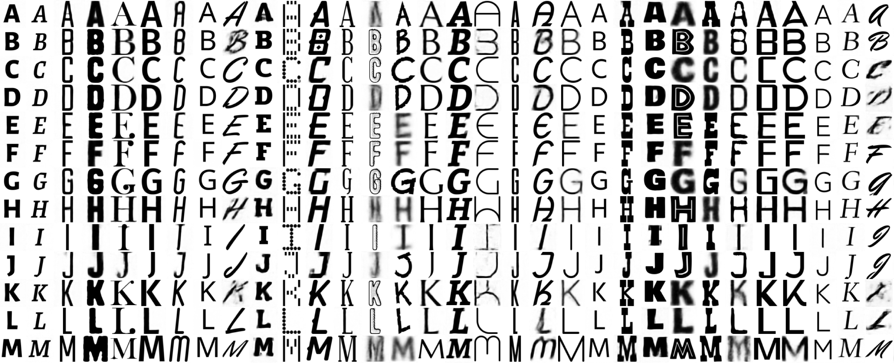

# Typeface Space (Honors Thesis)

Welcome to the repository for Typeface Space. This research is the honors thesis work of Sam Magid, advised by Professors Jeannie Albrecht and Mark Hopkins at Williams College. We spent the Fall 2024 and Spring 2025 semesters training autoencoder-based models to quantify the style of typefaces, in order to build style-based tools for font selection. You can find a prototype webapp font selector based on my research [here](http://sysnet.cs.williams.edu/~25sm39/).

This repository includes all of the files and scripts needed to reproduce my research. The `datamaker` folder contains the scripts needed to recreate our dataset, and the `autoencoder`, `styletransfer`, and `srivatsan` models contain all the model training files. `fontsite` contains all the React files for the font selector frontend, and `app-backend` contains all the scripts which peform backend computation to support the webapp. Finally, `proposal-presentation` and `final-presentation` contain all the resources for my two thesis presentations given in Spring 2025, and `thesis-writing` contains my thesis tex files as well as my final draft in PDF form.

I hope you find these files and my work useful. Please contact me with any questions at all!